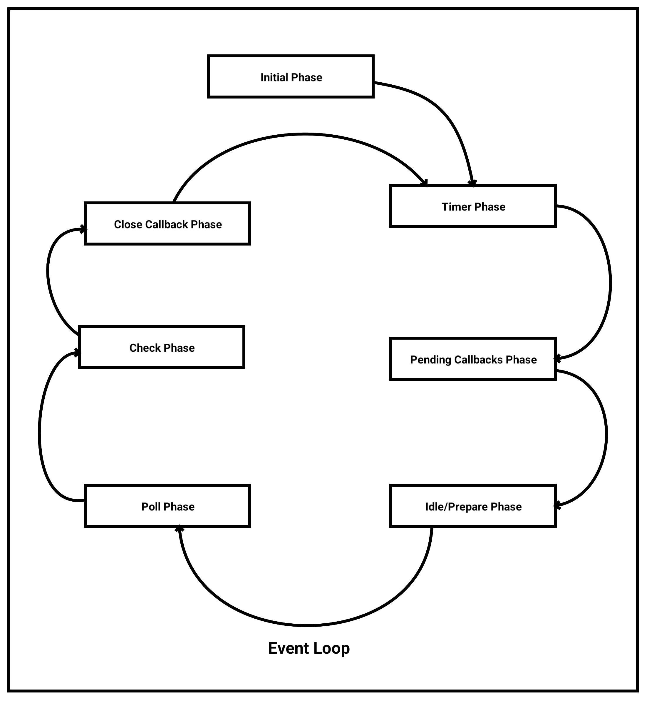
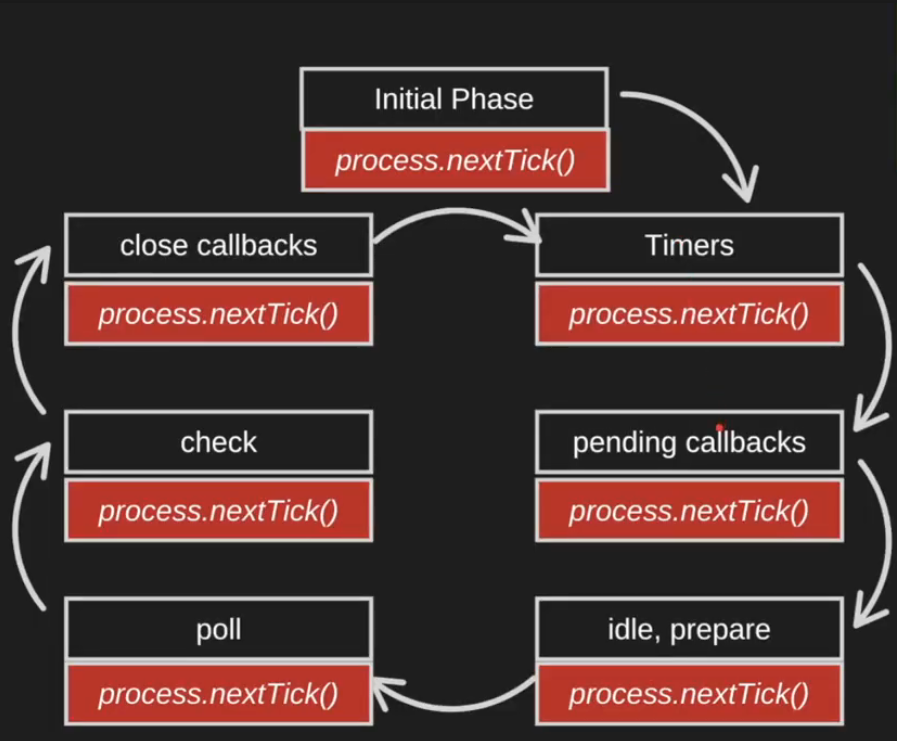

+++
title= "Node.js Internals (How node.js works under the hood)"
description= "Understanding Node.js internals in detail."
date= 2026-06-05
template="post.html"
+++

> Note: This article is based on Node.js v26.3.0 and Libuv v1.48.0

Most people don't know that Node.js runs JavaScript on a single thread. This often raises an important question and that question motivated me to learn Node.js internals.

**Question: If Node.js runs on single-thread then how can it handle millions of requests without becoming blocked?**

After spending hours reading documentation, watching videos and studying various resources, I finally have a clear understanding of how Node.js works internally.

In this article, I will share what I learned and explain the concepts in a simple and practical way that you will never forget :) .

* * *

# What is Node.js

Node.js is a **runtime or a program** which take javascript code as inputs, parse it, compiles it into machine level code and then execute it.

## Things you should know before understanding the Node.js Architecture/Internals

*   Callbacks
    
*   Epoll
    
*   V8 Engine
    
*   Libuv
    
*   Min Heap
    
*   Event Loop
    

I will just briefly explain each of these topics to give you enough context to understand what is happening throughout this article. However, these are broad subjects on their own. So I highly recommend you to do additional research if the explanations provided here are not sufficient for your understanding.

## Callbacks

Callbacks are just a **normal functions** that are passed to another function to be executed later when a **certain condition is met** such as when a timer expires, an event occurs or an asynchronous operation completes.

**Simple example:**

```cpp
// this is normal function 
const callback = ()=>{console.log("callback")}

// Here is another function 
setTimeout(callback,1000) 
```

In this example, `setTimeout()` is just an another function that takes a callback function and executes it later when a specific condition is met. The condition here is that timer of 1000 milliseconds.

## Epoll

This is an interesting thing you should know. `epoll` is just a system call. If you don't know what a system call is, Think of it as an API provided by the kernel that allows applications running in user space to talk to hardware indirectly as the kernel performs those operations on their behalf.

If you'd like to learn more about system calls, you can search for the topic online and explore it in greater detail.

Epoll Lets the application program to make os check for certian file events and tell os to notifi them when some new events occur on them some of the epoll apis we will see in this aricle are epoll\_wait epol\_ctl

`epoll` allows applications to ask the operating system to monitor multiple file descriptors for specific events, such as when data becomes available to read or when a socket is ready to accept a new connection. Instead of application repeatedly checking each file descriptor the os does the job.

Some of the `epoll` APIs we will discuss in this article are `epoll_ctl()` and `epoll_wait()`.

## V8 Engine

V8 Engine is the Javascript Engine developed by **Google** for their browser Chrome. Later node developers took out V8 engine from the browser combine it with additional components like libuv and C++ APIs to allow JavaScript to run outside the browser.

### Task of V8 Engine

*   Parsing
    
*   Interpertation
    
*   Compilation
    
*   Optimization
    
*   Garbage Collection
    
*   Execution
    

## Libuv Library

Libuv library is one of the most important pieces of code in the node.js that lets node run asyncronous operations.

In simple term Libuv is the library that interact with Operating System for handling async operations like I/0, Timers, Network calls and thread managements. We will talk later about its **exposed APIs** that node calls while performing async operations.

Learn more on : [Libuv.org](https://libuv.org/)

## Min Heap

A Min Heap is a complete binary tree data structure in which the value of each parent node is always less than or equal to the values of its child nodes. As a result, the smallest element is always stored at the root node of the heap.

Learn more on: [Min-heap](https://www.geeksforgeeks.org/dsa/introduction-to-min-heap-data-structure/)

* * *

## Event Loop

Event loop is a part of Libuv library that constantly look for **callbacks** in the queue and execute them one by one. We will be looking later how and when the event loop start, execute callbacks and what are that queues i am talking about.

There are different phases in the Event Loop and each phase have its one task to perform.

### Event Loop Phases

1.  Initial Phase
    
2.  Timer Phase
    
3.  Pending Callbacks Phase
    
4.  Idle/Prepare Phase
    
5.  Poll Phase
    
6.  Check Phase
    
7.  Close Callback Phase
    



### Initial Phase

First of all there is no such phase I just named it initial phase cause it consist of all things performed before event loop kicks in.

In this phase the Js code we wrote is parsed and executed line by line by V8 engine but V8 engine doesnot know how to execute specific asyncronous code like "setTimeout", "I/O operations" so when it sees those code it calls the **Node.js** provided **APIs** for such operations and under the hood those apis are implemented with the help of Libuv.

Lets look how this code is executed in initial phase

```javascript
console.log("hello world");
setTimeout(()=>console.log("This is callback"),1000);
console.log("end of js code");
```

Here, as you can see we have both normal syncronous and asyncronous code

How Node.js run above code

*   **Step 1 :** V8 sees `console.log("hello world")`
    
    *   It's a syncronous code so is parsed and executed right there.
        
*   **Step 2:** `setTimeout(()=>console.log("This is callback"))`
    
    *   When V8 encounters `setTimeout()`, it does not set the timer itself because `setTimeout` is not a built-in JavaScript feature provided by V8. Instead, `setTimeout` is an API exposed by Node.js. When the function is called, Node.js handles the request and internally uses libuv's timer APIs, such as `uv_timer_start(timer_handle, callback, 1000, 0);`to register and manage the timer.
        
    *   libuv receives the delay from Node.js and converts it into an absolute expiration timestamp. It then stores the timer in an internal min-heap ordered by expiration time. Each timer object contains the expiration timestamp and a reference to the callback function.
        
    *   However, libuv does not execute the callback immediately. Instead, the callback is only executed later when the event loop enters the Timers phase.
        
*   **Step 3:** Same as step 1.
    

To sum it up, this phase executes all the code line by line. As it encounters asynchronous operations it hands them off to libuv or the operating system on the go so they can be processed in the background. Meanwhile the main thread continues executing the remaining code. **One important thing to remember is that the event loop hasn't started yet.**

### Timer Phase

Actually this is the first phase of the event loop. This phase starts when initial phase is completed and event loop begin running.

**So what does this phase do?**

In Initial phase I said that the `setTimeout()`doesn't immediately run the callback , it just put the timer and callback in the heap right so in this phase expired timer callback are executed.

What it does internally is When the event loop enters the timers phase, Libuv **takes a snapshot of the current time at the beginning of that iteration.** Then it compares this value with the expiry time of node at the root of the min heap.

If the timer has expired, its callback is executed and the timer is removed from the heap. After removal, **the heap is reorganized and the next root element is checked using the "same snapshot".**

This process continues until there are no more timers whose expiry time is less than or equal to the snapshot time.

Lots of people have misconception that Node.js recalculates the current time for every comparison during same iteration. In reality the current time is computed only once for each Timer phase.

**Simplified Logic Code:**

```javascript
// This is the simplified logic function that runs for each Timer Phase  

function processTimers() {
    // take a snapshot of current time at the start of this event loop iteration
    const currentTime = getCurrentTime(); // (internally: uv_now(loop))

    // keep checking the root of the heap while timers are expired and also notice we are not updating the current time
    while (heap.isNotEmpty() && heap.peekRoot().expiryTime <= currentTime) {
        // get the timer with the smallest expiry time
        const timer = heap.popRoot();

        // execute its callback
        timer.callback();
    }
}
```

At this point, you might have a question: what happens if the callback of an expired timer takes long time to execute and during that execution, another timer's expiry time is reached?

The answer lies in how the timers phase processes timers. Like I already explained above At the beginning of each timers-phase iteration, Libuv takes a snapshot of the current time. All timer comparisons during that iteration are made against this snapshot.

As a result, even if the execution of one callback takes so long that another timer's expiry time is reached, the newly expired timer will not be executed during the current iteration because it is still being compared against the original time snapshot. Instead, it will be processed in the next event loop iteration when a fresh time snapshot is taken.

#### **Important to Understand**

`setTimeout()` does not guarantee exact timing. If you set a delay of 1 second, the callback is only guaranteed to run **not earlier than 1 second** but it may run later too.

The Node.js event loop does not start its phases until the initial phase is completed. After the initial phase is completed then only the event loop begins with the Timers phase. So from that we know if initial phase have some long time taking process, functions then timer is automatically delayed because node runs on single thread.

However, timers may still be delayed even if initial phase is completed quickly like when the event loop is busy executing other high priority callbacks which we will be talking in upcoming phases.

**Example for what I said Earlier:**

```javascript
setTimeout(fn, 1000);

while(true) {}
```

As the while loop is the syncronous code it will execute in initial phase and we know event loop will only start after initial phase is completed. Because the loop never end node js never be able to start event loop making imposible to reach timer phase executing the setTimeout callback. So, Hence timer is delayed here.

This is just one example showing how `setTimeout` can be delayed. There are many similar examples available online that you can explore, analyze and experiment to deepen your understanding.

### Pending Callbacks Phase

This is one of the interesting phase of event loop. It took me quite amount of time to fully understand what actually happens here but sorry to say it's much simpler than you think.

The Pending Callbacks Phase is the second phase of the event loop. One important thing to remember about this phase is **during the first iteration of the event loop, this phase usually has nothing to execute so it does nothing.**

**Nothing to execute ? Lets see,**

Its main purpose is to check the queue called **"pending callbacks queue"** and execute the callbacks available there. This queue holds certain callbacks that are **posponded** by the **Poll phase** to run in next event loop cycle.

Since the Poll Phase occurs later in the event loop cycle, there are no callbacks available in the queue when the Pending Callbacks Phase runs for the very first time. As a result this phase has nothing to process/execute.

At this point, you might be wondering just like I did "what kind of callbacks are actually stored in the Pending Callbacks Queue".

This phase executes I/O callbacks stored in `loop->pending_queue`. These are typically system-level I/O callbacks that were returned from the operating system with an error state during the previous loop's Poll phase.

For example, if a TCP socket attempts to write data or connect to a dead server, the Linux kernel might return an immediate error like `ECONNREFUSED`. Instead of executing the error handler instantly and disrupting the current I/O polling batch, libuv appends the callback to the pending queue to be executed cleanly at the start of the next event loop iteration.

### Idle/Prepare Phase

This phase is mostly hidden and many people dont know what actually happen here. Unlike other phases of the event loop, where developers can register callbacks using apis ( for example: `setTimeout()` callbacks for the Timers Phase and `setImmediate()` callbacks for the Check Phase) there is no JavaScript API that allows you to directly register callback for the Idle / Prepare Phase.

**So question still remains what actually happening here ?**

According to my knowledge this phase is combination of two phase idle and prepare phase

**Idle phase** job is it maintain the idle queue and execute the callback inside there. This queue holds a C++ struct datatype that have **few metadata and an empty c++ callback function.**

**How does that c++ struct get in there?**

So when V8 engine sees `setImmediate()` in your code it quickly send its callback in the **Check Queue** and create a C++ struct which is then inserted into that Idle queue. One thing to keep in mind is it doesn't create new struct each time it sees the `setImmediate()` in the code instead It first checks whether the queue already contain struct or not. If the struct exist then it simply push the callback of the `setImmediate` to the check queue if not then only it create new struct before pushing the callback to the check queue.

Now you know how that C++ struct get in there right. Lets get back to the idle phase.

```cpp
// Empty C++ Callback can be like this
void my_empty_callback() {
    return; // Do absolutely nothing
}
```

It now executes that empty callback function from the idle queue.Because the function was empty controll goes back to event loop but the struct from the **idle queue stays there until it reaches the check phase. Why? we will see later.**

**Prepare Phase** handles few things like running garbage collection freeing unwanted memory.

After prepare phase, comes one hidden operation called **Timeout Calcuation.** Here the timeout used by poll phase to determine how much time it should sleep/block main thread before moving to next phase is calculated. This timeout value is calculated using different conditions

1.  Check if the whole node js is exiting?
    
2.  Is there any callback in the Idle queue?
    

If above conditions are true then the timeout is set to 0. If every condition is false then it checks the timer heap if any remaining timer going to be expired based that it determine how long the poll phase should sleep.

For example: If the heap contain a timer that will expire in 5000ms it will configure such that the poll phase should wait for maximum 5000ms before moving to next phase.

If there are no timers in the heap then it consider no fixed timeout. In this case, the Poll phase can block indefinitely and simply wait until an I/O event occurs to wake it up.

This is the only important concept you have to take form this phase to understand the Node.js internal working mechanism. The rest of the details go much deeper into operating system and libuv internals and they can quickly turn into a rabbit hole. To be honest they not really needed to understand how the event loop works at a high level. And also If we start going into all of that the article would become much longer.

### Poll Phase

The timer we set before this phase it's used here so when the event loop reaches the poll phase, libuv calls a system call such as `epoll_wait()` (on Linux). This call blocks the thread and tells the operating system:

*"Monitor the file descriptors I previously registered. If any of them become ready for I/O, wake me up. Otherwise, wake me up when the specified timeout expires."*

If an event occurs before the timeout expires, `epoll_wait()` returns the file descriptors that are ready. Libuv then looks up the callbacks associated with those file descriptors and queues them and executed one by one.

**I think now you are now wondering what is that file descriptor and when we told os to moniter them ?**

Let's quickly go back to the initial phase.

When V8 executes JavaScript code and encounters an asynchronous operation. It cannot handle those operations by itself. Instead, it hands them over to Node.js and libuv.

For operations involving sockets, libuv performs the necessary system calls such as `socket()`, `bind()`, `listen()`, or `accept()`which return file descriptors. A file descriptor is simply a small integer that the operating system uses to identify an open resource such as a socket, file or pipe.

After obtaining these socket file descriptors, libuv registers them with the operating system's event notification mechanism using `epoll_ctl()` (on Linux). In simple terms, this is what libuv is telling to the operating system:

*"Please keep an eye on these file descriptors and notify me whenever they become ready for the events I'm interested in, such as reading or writing."*

Later, when the event loop enters the poll phase and calls `epoll_wait()`, the operating system checks all the file descriptors that were previously registered through `epoll_ctl()`. If any of them are ready, it wakes up the event loop and returns those file descriptors back to libuv for processing.

However, operations such as `fs.readFile()` are handled by libuv's thread pool because regular filesystem operations cannot be efficiently monitored using `epoll`. When a worker thread finishes its task it cannot directly execute the JavaScript callback because JavaScript runs only on the main thread.

To solve this problem, libuv uses a special file descriptor called `eventfd` which is also registered with `epoll`. After completing its work the worker thread places the completed request into an internal completion queue and writes to the `eventfd`. Since `epoll` is monitoring this descriptor, the write causes `epoll_wait()` to wake up immediately.

When libuv notices that the `eventfd` is ready it understands that one or more thread pool tasks have completed. It then processes the completion queue and invokes the corresponding JavaScript callbacks on the main thread.

In other words both socket I/O events and thread pool completions eventually wake up the event loop through `epoll` but they arrive through different paths.

### Check Phase

Node js have provided proper api through which developers can schedule callbacks to be executed on this phase. Using `setImmediate()` developers add the callbacks that needed to be executed in checks phsae.

You should try below code:

```javascript
const fs = require("fs");

fs.readFile(__filename, () => {
  setTimeout(() => {
    console.log("timeout");
  }, 0);

  setImmediate(() => {
    console.log("immediate");
  });
});
```

The outupt of above code will always be "immediate" then "timeout". The reason is simple this `fs.read` callback will be executed in poll phase and in that phase we added another two callbacks one is for timer phase and one in check phase so as checkphase is the next phase after poll the setimmediate callback will run immediately. This phase is most easy to understand out of all phase according to me.

### Close Callback Phase

This phase is also easy to understand much like check phase. This phase is responsible for executing callbacks associated with the `"close"` event of certain resources such as sockets and handles. The main difference is that these callbacks are **not scheduled immediately**. Instead, they are first registered as **event listeners** that wait for the corresponding close event to occur.

For example

```javascript
socket.on("close", () => {
    console.log("Socket closed");
});
```

When Node.js encounters the code above, it does not execute the callback or place it directly into the Close Callbacks phase queue. Instead, it registers the callback as a listener for the `"close"` event on the socket.

Later, when the socket is actually closed Node.js schedules the registered callback to be executed during the Close Callbacks phase of the event loop.

### Process.nextTick()

One last thing I want to explain is the **process.nextTick()** . Most people dont know enough about this function, they just know it exist there in Node.js. It is one of the most important concept you need to understand because lots of functions in Node.js uses it internally to schedule the callbacks and one of the popular ones is "**promises"**. Yes the promises. If you want to fully understand the promises in node js then you have to understand this concept first.

Before jumping on this lets learn one more term called "Tick". A tick occurs at exact microsecond the JavaScript engine finishes executing its current code and prepares to hand control to the C++ engine (libuv).

Actually Process.nextTick is part of node.js not libuv library. Each time it encounters this code in initial phase it push the callback in the **processNextTick queue.** And before handing the control to libuv it first checks the processNextTick queue if there exist any callbacks executes them immediately and then move on to next phase.



Here, you can see that `process.nextTick()` callbacks are executed whenever Node.js is about to hand control back to libuv.

For example, after the Initial Phase completes, Node.js checks whether there are any callbacks waiting in the `process.nextTick()` queue before allowing libuv to continue processing tasks such as timers.

Similarly, when libuv invokes a JavaScript callback during one of the event loop phases Node.js executes that callback and before returning control back to libuv executes the `process.nextTick()` queue again.

**And that’s it! You now understand a bit more about how Node.js works internally. From here on, I hope you dont just write javascript code but also understand what each piece of code is doing behind the scene.**
